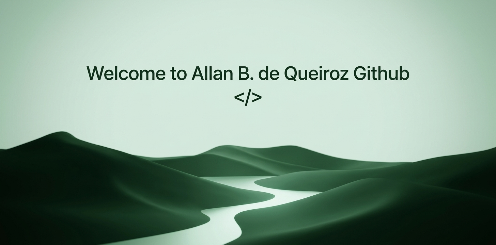
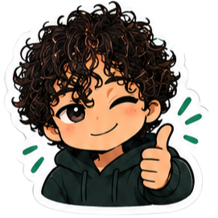
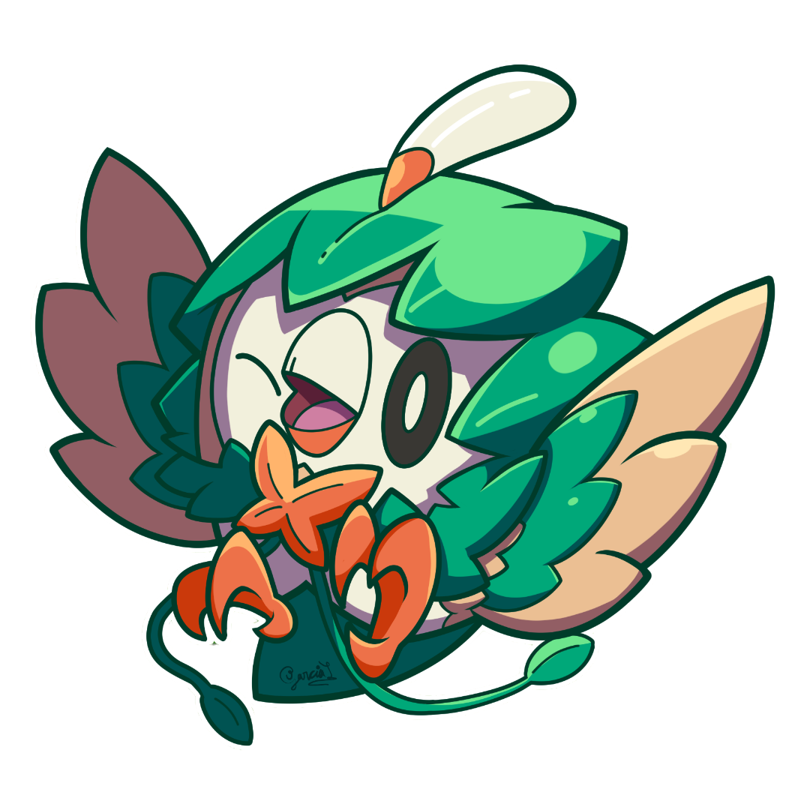

<!-- 1. BANNER PRINCIPAL -->

  

<!-- 2. BOTÕES DE REDES SOCIAIS (Fundo Sombra #0D1C14 + Ícones Laranja #E69138) -->

  
  

<!-- 3. TECNOLOGIAS (Fundo Verde-Floresta #1A3C2A + Ícones Laranja #E69138 e Verde-Luz #A1D1B7) -->
  <h3 align="center">  Technologies</h3>

  <!-- Ferramentas & Base -->
  
  
  
  
   
   
  <!-- Web & Dados -->
  
  
  
  
  
   
  <!-- Frontend & Design -->
  
  
  

<!-- 4. ESTATÍSTICAS (Fundo Black #00000 + Detalhes Laranja #E69138 + Texto Menta #D4E8DC) -->
<h3 align="center">⚽ Statistics</h3>

  
  

<!-- 5. ABOUT ME -->
<h3 align="center">⚽ About Me</h3>

<table border="0">
  <tr>
    <td width="30%" align="center" valign="middle">
      
    </td>
    <td width="70%" valign="middle">
      Hello! My name is <b>Allan B. de Queiroz</b>, and I am a Web Develop student. I am passionate about learning new technologies, developing innovative projects, and solving complex problems through programming. Currently, I am honing my skills in <b>JavaScript, React.js, C#, and SQL</b>, focusing on building robust applications and continuously growing within the tech industry.
    </td>
  </tr>
</table>

<!-- 6. HOBBIES & GOALS -->
<h3 align="center">⚽ Hobbies & Goals</h3>

<table border="0">
  <tr>
    <td width="70%" valign="middle">
      
Software Engineering student at Fametro.

      
When I'm away from the keyboard, I love playing acoustic guitar, play Pokémon, and spending time as a proud uncle to my 3 awesome kids. Balancing code, music, and family!

    </td>
    <td width="30%" align="center" valign="middle">
      
    </td>
  </tr>
</table>
